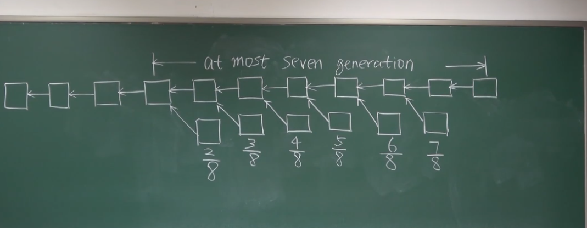

lab picnic hill code behave patrol exist minute short onion bitter any

## 数字货币

* 简单使用公私钥，会发生doble spending attack，也就是可以进行简单复制进行使用多次。

需要解决两个问题：
* 货币的发行
* 货币的验证

比特币的交易，有输入和输出。输入表示钱的来源（即第二种哈希指针），输出是接受者的公钥。 

转钱需要收入者的地址，地址是根据其公钥推算衍生出来的。假设A给B转账，B需要给A提供B的地址，B需要A的公钥,旁观者也要对交易进行验证。A的公钥是通过钱的来源的输出的公钥，所以不能被伪造。

验证过程是将交易的输入脚本和币的来源交易的输出脚本进行拼接运行，若能运行则交易被验证。

每一个block分为block header和block body。

header包括一些宏观的基本信息：
* version. 
* hash of previous block header。前一个区块块头的hash pointer
* merkle root hash, 
* target。块头的hash值 < target 
* nonce。随机数。

节点分为：
* full node。对交易进行验证。又叫fully validating node
* light node。不能独立对交易进行验证。

body主要是交易列表

交易如何写入到区块中。

账本内容需要取得分布式共识。（distributed consensus）

简单的形式，采用distributed hash table

FLP impossibility result

在一个异步系统中，即便有一个成员是faulty，也无法达成共识。

CAP Theorem（Consistency Availability Partition tolerance）
在分布式系统中以上三个性质只能满足两个。

比特币中的共识协议。

简单的投票机制，是不可行的，会出现女巫攻击。

算力投票。

新的区块应在最长合法链。

问题：矿工，也就是节点，通过计算得到nonce，从而取得记账权。


#### 比特币系统的实现

两种模式

* transaction-based ledger

全节点维护一个UTXO数据结构，Unspnet Transaction Output。即还未花费的所有交易的集合。

每个交易会消耗一些输出，也会产生一些输出。total inputs = total outputs。但由于交易费机制的存在，不一定会完全相等。

* account-based ledger

##### 挖矿的过程概率分析

现在挖矿不仅仅需要调整nonce，这样搜索空间太小，可以更改的范围还包括造币交易中的coinBase，它是32字节的数据，这样搜索空间就大了起来。

每次尝试都是一个伯努利试验（bernoulli trial: a random experiment with binary outcome）

多次进行，会产生一个bernoulli process，这是一个无记忆性的随机过程。

可以近似为poisson process。

概率密度是指数分布，无记忆性，又称为progress free，挖矿公平性的保证。类似守株待兔。

##### 比特币数量。

区块奖励每21万块降低一半。初始50。

总数量是2100万 = 21万 * 50 + 21万*25 + 21万*12.5....... = 21万 * 50 * (1 + 1/2 + 1/4 + ....) = 2100万

随着区块的增加，数量构成了一个geometric series。

Bitcon is secured by mining。

##### 比特币的安全性

防范forking attack，最简单的方法是多等几个确认区块。（缺省的是6个确认）

#### 比特币网络

应用层运行比特币协议

底层运行P2P overlay network，不存在超级节点和主节点。

设计原则是简单鲁棒性好，但是不考虑效率。

消息传播在网络中采用flooding的方式。节点第一次听到消息之后，会发给全部周围节点。

邻居节点是随机的，不考虑底层拓扑。

每个节点要维护一个等待上链交易的集合。前提交易是合法的。

对于有冲突的交易，节点优先加入最先收到的交易。

交易被加入到区块链后就会从集合中删除。

#### 调整挖矿难度

出块时间不是越短越好，否则会使区块链的安全性降低。短出块时间会导致同一时间出现很多分叉，在fork attack时，攻击者不需要51%的算力可能就可以攻击成功，因为好的节点的算力被分散到了多个分叉中，而坏的节点可以集中算力到其中一个节点上。

每2016个区块调整一次挖矿难度。
$$
target = target * \frac {actualTime}{expectedTime}
$$
actualTime是最近2016个区块的平均时间，expected是目标区块产生平均时间

#### 挖矿

全节点

* 一直在线
* 在本地硬盘维护完整的区块链信息
* 在内存里面维护UTXO集合，以便快速检验交易

#### 比特币的脚本

输入输出脚本类型：

* P2PK（Pay to public Key）

input script：

​	PUSHDATA（Sig）

output script：

​	PUSHDATA（PubKey）//收款人的公钥

​	CHECKSIG

* P2PKH（Pay to Public Key Hash）

input script:

​	PUSHDATA（Sig）

​	PUSHDATA （PubKey）

output script:

​	DUP// 把栈顶元素复制一遍，放到栈顶

​	HASH160 // 把栈顶进行hash并放到栈顶

​	PUSHDATA（PubKeyHash）

​	EQUALVERIFY

​	CHECKSIG

* P2SH（pay to script hash）

  主要用来解决多重签名。

  分两步验证，第一步验证redeem script的hash

  第二步执行redeem script来验证签名

* proof of Burn, 产生的输出脚本，会包含一个return，该语句在执行时，会产生无条件错误。

#### 比特币系统分叉（fork）

两个节点同时获得记账权，而产生的分叉叫做**state fork**

协议升级，部分节点不支持升级，而产生的分叉叫做**protocl fork**，根据对协议内容修改的不同，又可以分为**hard fork** 和 **soft fork**

* hard fork：eg，block size limit 变大，永久性分叉
* soft fork： eg，block size limit 变小，非永久性分叉。给某些目前协议中没有规定的域增加一些新的含义，赋予新的规则。一个例子是coinbase tx中的coinbase域。有人提议在coinbase中添加utxo的根hash 

#### 问答

事先如何知道交易费给谁。

#### 比特币的匿名性（BitCoin and anonimity）

pseudonymity 

### 以太坊

memory hard ming puzzle

proof of work -》 proof of stake。

增加了对智能合约的支持。（smart contract）

bitcoin：decentralized currency

Ethereum：decentrailed contract 

去中心化的合同好处

合同的不可篡改。

#### 以太坊账户

 基于账户的账本。

防范double spending attack

防范 replay attack

两类账户：

* externally owned account。公私钥控制
    * balance 
    * nonce
* smart contract account。不通过公私钥。不能主动发起交易。
    * nonce
    * code
    * storage

#### 以太坊的状态树

完成的是一个从账户地址到账户状态的映射。（addr -> state）

其中addr是160bit，40个16进制数。

trie （字典树）

Patricia tree（路径压缩字典树）

Merkle Patricia tree （MPT）

modified MPT （以太坊的mpt）

value 通过序列化进行存储。（RLP，Recursive Length Prefix）

> protocal buffer（序列化的库）

#### 以太坊的收据树和交易树

交易树和收据树都是mpt

交易树和收据树的信息都是当前区块中的交易。

key是交易在区块中的序号。

为了高效查找，引入了`bloom filter`，给一个很大的集合计算出一个紧凑的摘要。对集合元素取hash，找到在向量中的位置，并置为1,最终得到一个摘要向量。但考虑到hash碰撞，在查找时，不在集合中，一定不在集合中，在集合中，可能在也可能不在。不支持删除操作。

每一个交易会产生一个收据，对每一个收据产生一个bloom filler，最终块头中的bloom filter是所有收据bloom filter的并集。

以太坊的运作过程可以看作是一个交易驱动的状态机。

transaction-driven stata machine

状态是所有账户的状态，交易的执行驱动系统状态进行变化。

#### 以太坊的共识协议——GHOST

核心思想：挖到了矿，但没有成为最长合法链，以太坊给予其一定的奖励。（7/8的初块奖励），这些区块作为当前区块的uncle block。当前区块每包括一个uncle block，会得到额外的1/32的初块奖励，一个区块最多包含两个uncle block。

修改：

* 允许隔辈当作叔父区块。

* 隔代缩减，隔的辈数越多，叔父区块的初块奖励越少，从7/8, 6/8, 5/8..........2/8,也即做多相隔七代。合法的叔父只有六辈以内。

    有利于鼓励尽早合并分叉。

* 只有分叉之后的第一个叔父区块可以得到奖励。

#### 以太坊的挖矿算法

ASIC resistance，做法：memory hard mining puzzle

早期的LiteCoin，使用scrypt算法，但内存使用仅128KB

以太坊使用两个数据集，一个是16MB的cache，一个是1GB dataset。但所占空间都会随着时间逐渐变大。  

其中首先通过seed产生cache，第一个hash是seed的hash，接下来每一个数都是前一个的值取hash。seed每隔30000个区块会重新生成。

pre-mining，预留给早期开发者

##### 以太坊的难度调整




难度炸弹

#### 以太坊权益证明（proof of stake）

TWH Terawatt hours （10的12次方）

挖矿本质是资金多，收益多，那么直接将资金投入到区块链的开发中，得到收益后，按资金比例分配。也被称为virtual mining。

采用权益证明的加密货币会预留货币给予开发者。 

权益证明是一种闭环。

工作量证明不是一种闭环。

Casper the Friendly Finality Gadget （FFG）

#### 智能合约

智能合约是运行在区块链上的一段代码，代码的逻辑定义了合约的内容。

不同的指令，耗费的汽油费不同。

交易的执行具有原子性。

出现异常会进行回滚。

#### The DAO

DAO：Decentralized Autonomous Organization

致力于众筹投资的DAO：The DAO。

实际上是一个以太坊的合约，投入以太币，然后换取DAO代币，代币越多，投票权重越大，最终受益也是按照合约内容来分配。

实际上类似于DAC：Decentralized Autonomous Corporation。

####  反思

> Is smart contract really smart？

Smart contract is anything but smart

> Irrerocability is a double damaged sword

 

decentralized != distributed 

智能合约：是在互不信任的实体之间需要建立共识的情况下进行编写。

智能合约主要实现控制逻辑的编写，而非存储与大数据计算

#### 美链 BEC

ICO Initial Coin Offering

IPO 

#### 总结


### Solidity

#### 转账操作

```solidity
1. address.send(); // 固定汽油费2300gas，在汽油费用尽或转账失败时，不会抛出异常，但会返回值为false，但已经转入的钱，无法回退，需要手动判断返回值，来决定是否进行回滚
2. address.transfer(); // 固定汽油费2300gas，转装失败时，会触发revert，回滚，安全
3. address.call.value()(); //可选汽油费，但默认将剩余全部汽油费作为调用。啥也没有
```

#### fallback函数

fallback函数固定声明为`fallback() payable external{}`，在没有receive函数时，会调用fallback函数，在有receive函数时，会优先调用receive。

#### 字符串拼接

```solidity
 function concat(string memory _base, string memory _value) pure internal returns (string memory) {
        bytes memory _baseBytes = bytes(_base);
        bytes memory _valueBytes = bytes(_value);
        
        string memory _tmpValue = new string(_baseBytes.length + _valueBytes.length);
        bytes memory _newValue = bytes(_tmpValue);
        
        uint i;
        uint j;
        
        for(i=0;i<_baseBytes.length;i++) {
            _newValue[j++] = _baseBytes[i];
        }
        
        for(i=0;i<_valueBytes.length;i++) {
            _newValue[j++] = _valueBytes[i];
        }
        
        return string(_newValue);
    }
```


> 如何实现erc223协议中的receiveTokenFallbak函数，来让合约支持满足erc223协议的代币，并对其如何进行处理？

#### 安全随机数

#### 多重返回值

```solidity
function two(uint a, uint b) {
	return a;
}

function call() returns(uint) {
	return two({b:4, a:5});

}

function multReturn(uint a, uint b) returns(uint, uint, uint) {
	return (a,c,a+b);
}

```

/usr/lib/jvm/java-8-openjdk-amd64/jre/bin/java
