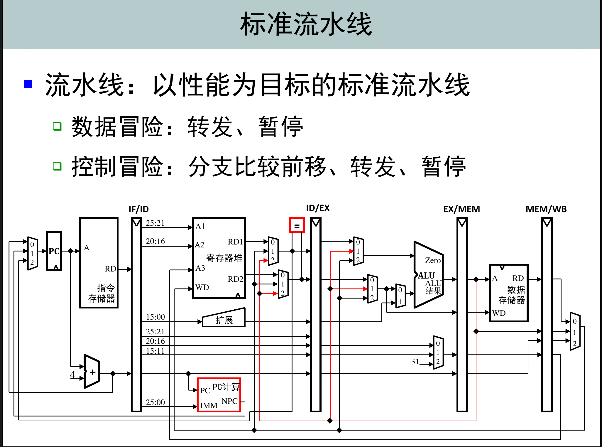
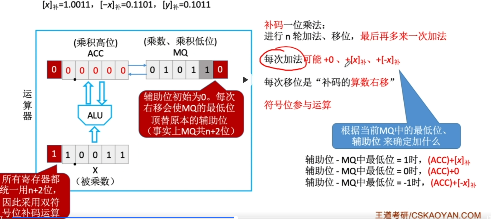

# 计算机组成原理 

流水线

### 补码原码转换

一个正数的相反数的补码表示，即一个负数的补码：（也是由一个负数的补码求其相反数的补码即其绝对值的方法）

* 首先写出正数的原码，然后找到右边的第一个1，然后对这个1的左边全部数进行取反，右边不变，即可得到负数的补码形式。
* 或者对正数的原码进行取反加一。

将一个负数的补码形式转换为原码形式（其实是方便求出其数值，比如已知-9的补码，将其转换为原码来查看数据位的值，然后得知其为-9）：

* 找到数据位中最右边的1，然后对其左边的数据位进行取反，右边不变即可得到其原码表示。
* 数据位进行取反加一

其实这个过程也可以通过对负数的补码形式进行取反加一来得到其相反数，也即正数，即负数的绝对值，然后再将符号位改为1也可以。

### 加减溢出判断

$ A + B  = S$

* 1位符号位。
  * $A_s$为A的符号位，$B_s$为B的符号位，$S_s$ 是S的符号位，那么$V = A_sB_s\overline S_s + \overline A_s \overline B_sS_s$ 。V是0表示未溢出，是1表示溢出。
  * 根据数据进位情况判断溢出。数据最高位的进位和符号位的进位不同表示溢出，符号位不进位，最高位进位，则表示上溢，符号位进位为1，但最高位进位为0，则表示下溢。
* 双符号位。正数的符号位为00，符号的符号位为11
  * 加减结果符号位若为01，即表示期望符号位为0，结果却是1，表示上溢。
  * 加减结果符号位若为10，即表示期望符号位为1，结果却是0，表示下溢。

### 符号扩展

* 定点小数的扩展
  * 在原符号位和数值位后面添加新位，正数都添加0
  * 负数的原码、补码都添加0，负数的反码添加。
* 定点整数的扩展。（显然）

### 原码乘法

原码一位乘法

使用ACC（只有数据位）和 MQ（只有数据位）两个寄存器进行计算。

计算过程：

首先将MQ置为乘数，ACC置为0，然后每次选取MQ的最低位，若为1，则将ACC中的值加上被乘数，结果存入ACC寄存器中，若为0，则ACC寄存器的值不变，然后将ACC和MQ两个寄存器中的数都逻辑右移一位（**高位要补0**），然后重复进行n（数据位有几位进行几次，以运算结束后右移为结尾）次，最终得到ACC中的数为乘积高位，MQ的数为乘积的低位。最终的符号位通过原符号位进行异或得到。

### 补码乘法

进行n轮加法、移位，最后多一次加法。

辅助位-MQ最低位 = 1， ACC +  $[x]_{补码}$

辅助位-MQ最低位 = 0， ACC +  $0$

辅助位-MQ最低位 = -1， ACC +  $[-x]_{补码} $ 

计算过程：

 MQ（包括符号位）置为乘数，辅助位是MQ的最低位后面额外增加一位，初始置为0。

ACC寄存器初始置为0，其中ACC寄存器与被乘数均采用双符号位。

每次根据辅助位-MQ的最低位来进行判断ACC中的数加上什么，加完之后，进行**算术右移**  

进行n轮（即数据位有几位进行几次，以运算结束后右移结尾）

n轮之后，再进行一次加法，规则和前面一致，但是并不进行右移。

最后的结果为ACC拼上MQ的值。符号位参与了运算。

图示：

### 原码除法

符号位不参与计算

参与计算的是真值，也即绝对值，下面的除数和被除数均为正数

首先ACC寄存器初始存储被除数，MQ寄存器存储商，初始置为0

**有点乱**

逻辑左移n次！！

### 补码的除法

符号位参与除法

双符号位

## Cache

### whatever

* Cache主要解决系统速度，而虚拟存储器是为了解决主存容量。

### Cache写策略

#### 命中

* **全写法（写直通法，write-through）**。命中时，将内容同时写到Cache和主存中。
* **写回法（write-back）**。命中时，直接对Cache块进行修改，而不写回主存，在Cache块被换出时，写回主存。

#### 未命中

* **写分配法（write-allocate）**。缺失时，加载主存中的块到Cache中，然后更新这个Cache块。
* **非写分配法（not-write-allocate）**。缺失时，只写回到主存中，不再进行调主存块到Cache中。

全写法通常与分写分配合用，写回法通常与写分配法合用。

## 指令系统

### 指令格式

### 数据寻址方式

* 立即数寻址
* 寄存器直接寻址，数据存储在寄存器中。
* 寄存器间接寻址，数据的地址存储在寄存器中。
* 基址寻址。lw s1   s2(100)
* 变址寻址。
* 相对寻址。beq s1 s2 100
* 堆栈寻址。即SP

## 总线

### 总线特性

机械特性。

电气特性。

功能特性。

时间特性。

### 总线结构

* 单总线结构。CPU、主存、IO设备（IO接口）公用一组总线
* 双总线结构。分为主存总线和IO总线。CPU、主存、通道通过主存总线进行通信，通道和IO设备（IO接口）之间通过IO总线进行通信。
* 三总线结构。分为主存总线、IO总线和DMA总线。CPU和主存通过主存总线进行通信，主存可以与外设通过DMA总线来直接进行数据传送，CPU通过IO总线和IO接口进行通信

### 总线仲裁

* 集中仲裁。
  * 链式查询。公用同一条总线请求（BR），需要的设备通过BR向总线控制部件发送请求，总线控制部件判断当前总线是否忙，不忙时，将总线应答信号，通过总线应答线（BG）发送，BG是串联在各个设备之间的，优先级固定，从前到后，遇到需要总线的设备，便被拦截，不再传递。**优点**：线少。容易扩充。**缺点**：故障敏感、优先级固定。
  * 计数器定时查询。计时器定时，通过一条新的设备地址线将计数器的值传递，当计数器的值与设备地址相同，设备发出总线忙信号，计数器不再定时。**优点**：优先级灵活。**缺点：** 线多。
  * 独立请求。每一个设备都有单独的BR与BG，优先级在总线控制器中实现。**优点**：响应快，优先级灵活，请求可屏蔽。**缺点**：线多。
  
* 分布式仲裁

  不需要中央仲裁器，每个模块都有自己的仲裁号和仲裁器，当有总线请求时，就会把它它们各自唯一的仲裁号发送到共享的仲裁总线上，每个仲裁器从仲裁总线上获取仲裁号和自己的仲裁号进行对比，若总线上的仲裁号优先级高，则它的总线请求不予响应，并撤销自己的仲裁号，最终获胜者的仲裁号保存在仲裁总线上。

### 总线传输

过程：

* 请求总线：由需要使用总线的部件或设备，提出总线使用申请。
* 总线仲裁：仲裁器决定下一次传输周期的总线使用权是否授予该部件或设备
* 寻址：获得总线使用权的部件或设备，发出地址和有关命令。
* 信息传送。进行数据传输。
* 结束阶段。将该请求模块的信息从系统总线上撤销，让出总线使用权。

协调通信双方，通信控制方式：

* 同步定时。采用统一的时钟信号来协调发送和接收方的传送定时。
* 异步定时。
  * 不互锁。主设备请求发出之后，一段时间撤销，从设备接收到请求后，发送应答请求，一段时间撤销
  * 半互锁。主设备必须等到从设备应答之后，才可以撤销，从设备发出应答请求后，一段时间自行撤销。
  * 全互锁。主设备等到从设备应答之后才可以撤销请求，从设备等到主设备撤销请求后，才可以撤销应答。

## 输入/输出系统

### 概念

* **I/O接口**：在各个外设与主机之间传输数据时进行各种协调工作的逻辑部件。协调包括传输过程中速度的匹配、电平和格式转换等。
* **外存设备**：指除计算机内存及CPU缓存等外的存储器。比如硬盘、光盘等。

一般来说IO系统由IO软件和IO硬件组成。

* **IO软件**：包括驱动程序、用户程序、管理程序、升级补丁等。通常采用 **IO指令**和 **通道指令** 实现CPU与IO设备的信息交换。其中IO指令是由CPU执行，通道指令存储在内存中，由通道执行。
* **IO硬件**：包括外部设备、设备控制器和接口、IO总线等。

### 外存储器

> 详细参考<a href = "#cipan">这里</a>

* 磁盘存储器。一块硬盘由若干记录面，每一个记录面划分为若干磁道，每条磁道划分为若干扇区，扇区也称为块是磁盘读写最小单位。

### IO接口

**IO端口**是指IO接口电路中可以进行读/写的寄存器，若干端口加上IO控制逻辑组成IO接口。

### IO端口的编址

IO端口一般通过IO指令进行访问，CPU想要访问IO端口就需要对各个端口进行编号。端口编址的方式有两种：

* 统一编址。又称存储器映射方式。把IO端口当作存储器单元进行地址分配，优点在于**不需要单独设计IO指令**，通过统一的访存指令就可访问。缺点：速度慢，内存容量变小。
* 独立编址。又称IO映射方式。IO端口地址空间是独立的。需要单独设计IO指令，需要CPU提供存储器读写的基础上增加对IO设备读写的控制信号，增加了控制的复杂性。

### IO方式

#### 程序查询方式

  CPU不断对外设状态进行轮询。

#### 程序中断方式

**异常**：异常是CPU内部引起的意外事件。分为硬故障中断和程序性异常：

* 硬故障中断由硬连线出现异常引起的。如电源掉电、存储器线路出错等。
* 程序性异常也称**软中断**，是指在CPU内部因执行指令而引起的异常事件。如整除0溢出、断点、非法指令、栈溢出、地址越界、缺页、分时系统中的时间片中断及用户态到核心态的切换等。

按照发生异常的报告方式和返回方式的不同，内部异常可分为**故障（Fault）**、**自陷（trap）**和**终止（Abrot）**。

**中断请求**

* 中断请求触发器（INTR）：每一个中断源配置一个中断请求触发器。中断源可通过设置中断请求触发器来提出申请。
* 各中断源的请求触发器组成中断请求标记寄存器。

**中断判优**

中断系统任何时候都最多只能响应一个中断源的请求。中断判优方式有：硬件排队判优，和软件排队判优。

**中断响应**：

条件：当前执行的程序允许被中断。

时机：当前指令执行完后，才能响应中断。

CPU在响应中断后，开始执行**中断隐指令**，中断隐指令是完全由硬件实现的。作用：

* 关中断
* 保存断点。程序计数器PC入栈。
* 引出中断服务程序。实质是取出中断服务程序的入口地址，并传送到PC。

中断向量：每一个中断都有自己对应的中断服务程序，每一个中断服务程序都有对应的入口地址，CPU必须找到这个中断地址，即中断向量。把全部的中断向量放到一起形成中断向量表。

**中断处理过程**（单重中断）

* 关中断。
* 保存断点。
* 中断服务程序寻址
* 保护现场
* 执行中断服务程序
* 恢复现场和屏蔽字。
* 开中断
* 中断返回。

**中断屏蔽**：主要用于多重中断技术中。每一个中断源都有一个屏蔽触发器，1表示屏蔽该中断源，0表示可以正常申请。所有屏蔽触发器组合在一起构成一个屏蔽字寄存器。

#### DMA方式

DMA方式是一种完全由硬件进行成组信息传送的控制方式。

**DMA过程**：

* CPU工作：初始化DMA控制器
  * 设置数据传送方向
  * 设置IO接口地址
  * 设置存储器起始地址
  * 设置传送的数据数量
  * 有关中断方式的设置
* DMA请求。
  * 党接口做好数据传输的准备，通过有关逻辑向CPU发出DMA请求信号
* DMA响应
  * CPU接到DMA请求，在**当前总线周期操作结束后**，暂停对CPU对系统总线的控制和使用，发出DMA响应信号，并交出系统总线的控制权。
* DMA操作。
  * 

#### DMA与中断方式的区别

* 中断方式是程序的切换，需要保护和恢复现场，而DMA方式除了预处理和后处理，其他时候并不占用CPU的任何资源
* 对中断请求的响应只能发生在每条指令执行完毕后（即指令的执行周期后）；而对DMA请求的响应可以发生在每个机器周期结束时（在取指周期、间址周期、执行周期后均可），只要CPU不占用总线就可以被响应
* 中断传送过程需要刚刚CPU的干预；而DMA传送过程不需要CPU干预，因此数据传输率非常高，适合于高速外设的成组数据传送。
* DMA请求的优先级高于中断请求。
* 中断方式具有对异常事件的处理能力，而DMA方式仅局限于传送数据块的IO操作
* 从数据传送来看，中断方式靠程序传送，DMA方式靠硬件传送。

# 操作系统

>  考试题目大题：
>
> * 文件
> * PV操作
> * 死锁
> * 内存

## 概述

### 发展

* 手工阶段

* 单道批处理系统
* 多道批处理系统
* 分时操作系统
* 实时操作系统

### 系统调用

用户在程序中调用操作系统所提供的子功能，系统调用可以视为特殊的公共子程序。

在用户程序中，凡是与操作系统有关的操作，比如（存储分配、IO传输及管理文件等）都必须通过系统调用的方式向操作系统提出服务请求，并由操作系统代为完成。

系统调用按照功能可以分为：

* 设备管理
* 文件管理
* 进程控制
* 进程通信
* 内存管理

系统调用的执行需要在内核态下进行。

也即当用户通过上层程序使用系统调用，会执行**陷入指令**，将CPU的状态从用户态转换为内核态，之后系统中的内核程序再对系统调用做出相应的处理。处理结束后，会将CPU回到用户态。

陷入指令在用户态执行，不是特权指令

中断返回指令是特权指令。

## 进程

进程是系统进行资源分配和调度的一个独立单位。

进程的状态：

* 运行态。进程正在处理机上运行

* 就绪态。进程拿到了除处理机之外的全部资源。

* 阻塞态。进程在等待某一个事件（不包括处理机），此时即便处理机空闲，进行也不能运行

* 创建态。正在被创建。

* 结束态。进程正在消失。

进程被创建后便进入就绪态。

### 进程控制

一般把进程控制用的程序段成为原语，原语的特点是在执行期间不允许终端，是一个不可分割的基本单位。

#### 父进程与子进程

允许一个进程创建另一个进程，创建者为父进程，被创建的进程称为子进程。子进程继承父进程所拥有的全部资源。子进程被撤销后，应将父进程的资源归还。父进程被撤销，其所有子进程也必须被撤销。

### 进程的组织

操作系统通过对PCB来对进程对进程进行控制。PCB包含很多内容。与进程有关的内容都记录在PCB中。包括堆栈指针，代码段指针，数据段指针，各种寄存器的值，以及进程的状态和进行的优先级等。

### 进程的通信

PV操作是低级通信方式，高级通信方式是指以较高的效率传输大量数据的通信方式。

#### 共享存储

存在一块可以直接访问的共享空间，通过对共享空间的读写来进行信息交换。低级的方式是数据结构的共享，高级的是基于存储区的共享。

#### 消息传递

进程通过系统提供的发送消息和接收消息两个原语进行数据交换。分为直接通信和间接通信。

直接通信：发送方将消息发送到接收方，并挂在接收进程的消息缓冲队列中。

间接通信：消息发送到某个中间实体，接收方从中间实体那里获取消息，中间实体一版称为信箱。

#### 管道通信

### 线程

进程是资源分配的基本单位，线程是处理机调度的基本单位，所有的线程共享其所属进程的所有资源和代码。

线程共享进程的数据的同时，有自己私有的堆栈。

线程不能单独执行，但每一个线程都有程序的入口、执行序列以及程序出口。它必须组成进程才能够被执行。

#### 进程v.s.线程

* 一个进程可以拥有多个线程，而一个线程同时只能被一个进程所拥有
* 进程资源分配的基本单位，线程是处理机调度的基本单位，所有的线程共享其所属进程的所有资源与代码。
* 线程执行过程之中很容易进行协作同步，而进程需要通过消息通信进行同步
* 线程的划分尺度更小，并发性更高
* 线程共享进程的数据的同时，有自己私有的堆栈
* 线程不能单独执行，但是每一个线程都有程序的入口、执行序列以及程序出口。它必须组成进程才能被执行。

#### 线程实现方式

* 用户级线程。有关线程管理的所有工作均由应用程序完成，内核意识不到线程的存在。
* 内核级线程。

### 进程的调度

#### 调度的概念：

* 作业调度。又称高级调度。从一次性提交的作业中挑选一个作业进行执行。对于每一个作业只调入一次，调出一次。

* 内存调度。又称中级调度。从存储器资源的角度将进程的部分或全部换出到外存，将当前所需要的部分换入到内存中。

* 进程调度。又称低级调度。从CPU资源的角度，执行的单位时间上通常是ms。

#### 何时进行调度

不可进行调度的情况：

* 处理终端过程中
* 进程在操作系统的内核程序临界区中
* 其他需要完全屏蔽中断的原子操作过程中。

引起进程调度和切换的情况：

* 发生引起调度的条件，且当前进程无法继续进行下去。
* 中断处理结束或trap结束之后。

进程的切换往往在调度完成之后立刻进行，它会保存原进程当前切换点的线程信息，恢复被调度进程的现场信息。

#### 进行调度的方式

* 非剥夺式调度，又称非抢占方式。当有新的比当前正在运行的进程优先级更高的进程请求调度时，仍然让当前正在执行的进程继续进行，直到完成或阻塞，才进行调度。
* 剥夺式调度，又称抢占式。当前进程可以被某个更为重要或紧迫的进程抢占处理机资源。

#### 调度的评价原则

* CPU利用率。
  $$
  CPU利用率 = \frac {CPU忙时间}{总时间}
  $$
  
* 系统吞吐量。表示单位时间内CPU完成作业的数量。

* 周转时间。指从作业提交到完成所经历的时间。

* 平均周转时间。即所有作业的周转时间的平均值。

* $$
  带权周转时间 = \frac {作业周转时间}{作业实际运行时间}
  $$

* 平均带权周转时间。所有作业的带权周转时间的平均值。
* 等待时间。即进程处于等处理机状态的时间之和。
* 响应时间。指从用户提交请求到系统首次产生相应的时间。

#### 典型的调度算法

* 先来先服务算法（FCFS）。非抢占式算法。不会导致饥饿

* 短作业优先算法（SJF）。属于非抢占式算法，每次从队列中取出完成需要时间最短的作业。会导致饥饿

* 短作业优先的抢占式算法。最短剩余时间优先，比较剩余时间来决定优先调度。会导致饥饿。

* 优先级调度算法。从队列中取出优先级最高的作业。会导致饥饿。

    * 抢占式：有优先级高的作业进入队列，会立即暂停当前作业，并将处理机分配给优先级高的作业。
    * 非抢占式：与抢占式恰好相反。

    此外根据进程优先级可以分为静态优先级和动态优先级。

    * 静态优先级。优先级在进程被创建的时候确定。
    * 动态优先级。根据进程情况的变化进行动态的调整。

    优先级的设置的原则：系统进程>用户进程，交互型进程>非交互型进程，IO型进程>计算型进程。

* 高响应比优先调度算法。
    $$
    响应比 = \frac {等待时间+要求服务时间}{要求服务时间}
    $$
    不会导致饥饿。

* 时间片轮转算法。主要适用于分时系统。系统将进程按照到达先后次序排成一个队列，进程调度程序每次选择队列中的第一个进程进行执行，但是只能执行一个时间片，时间片结束后，被剥夺处理机并放到就绪队列末尾重新排队。

* 多级反馈队列。多个队列，每一个队列优先级和时间片也不同，优先级越高的队列时间片越小。每一个队列按照先来先服务，时间片结束后，若未结束，则转入到下一个队列的末尾进行排队，直到最后的队列，在其中按照时间片轮转算法执行，直到结束。只有当上一个优先级的队列为空时，才会调度下一级的队列。

### 进程同步

临界资源：我们将一次只允许一个进程使用的资源称为**临界资源**。访问临界资源的**代码**称为**临界区**。

同步，也称直接制约关系，是指为完成某种任务而建立的两个或多个进程，这些进程因为在某些位置上协调它们的工作次序而等待、传递信息所产生的制约关系。进程间的直接制约源于它们之间的相互协作。

互斥，也称间接制约关系。当一个进程进入临界区使用临界资源时，另一个进程必须等待，当占用临界资源的进程退出临界区后，另一进程才允许去访问此临界资源。

同步机制应该遵循的准则：

* 空闲让进
* 忙则等待
* 有限等待
* 让权等待

#### 实现临界区互斥的基本方法

在使用信号量进行进程同步控制时，信号量初始值应为0，在进行互斥访问时，信号量初始值应为1。
（理解）

#### 死锁

死锁产生的必要条件：

* 互斥条件。进程要求对所分配的资源进行排他性控制
* 不剥夺条件。进程所获得的资源在未使用完之前，不能被其他进程强行夺走。
* 请求并保持条件。进程已经保持了至少一个资源，但又提出了新的资源请求，而该资源被其他进程占有，此时进程阻塞，但不释放自己的资源。
* 循环等待条件。存在一种进程资源的循环等待链。

#### 死锁的处理策略

* 死锁预防。破坏死锁产生的四个**必要条件**。
    * 破坏互斥条件。
    * 破坏不剥夺条件
    * 破坏请求并保持条件。采用预先静态分配法。在进程运行前一次申请完它所需要的全部资源，否则不允许运行。一旦开始运行，直到结束资源不会被剥夺。这样会导致某些资源仅仅使用时间很短却一直被占用，效率低，可能导致饥饿。
    * 破坏循环等待条件。可采用顺序资源分配法。给系统的资源进行编号，每个进程必须按照编号递增的顺序进行申请资源，同类资源一次申请完。编号必须相对稳定，限制了新类型设备的增加。
* 死锁避免。
    * 安全状态
    * 银行家算法。（理解）
* 死锁检测。
    * 资源分配图
    * 死锁定理。S的资源分配图是不可完全简化的是S死锁的充分必要条件。
* 死锁解除
    * 资源剥夺法。挂起某些死锁进程，抢夺其资源。
    * 撤销进程法。强行撤销部分甚至全部死锁进程并剥夺资源，撤销要按照撤销代价和进程优先级进行排序。
    * 进程回退法。让一个或多个进程回退到足以回避死锁的地步，进程回退是资源放弃资源而非剥夺。需要系统保持进程的历史信息，设置还原点。

## 内存管理

内存管理的功能：

* 内存空间的分配和回收
* 地址转换
* 内存空间的扩充
* 存储保护

### 程序装入

* 编译
* 链接
    * 静态链接
    * 装入时动态链接
    * 运行时动态链接
* 装入
    * 绝对装入
    * 可重定位装入
    * 动态运行时装入

### 内存保护

* 上下寄存器法。在CPU中设置一对上下限寄存器，存放用户作业在主存中的下限和上限地址，每当CPU访问一个地址，先进行判断是否越界。
* 重定位寄存器与界地址寄存器。重定位寄存器是最小物理地址，界地址寄存器是逻辑地址的最大值，每一个逻辑地址必须小于界地址寄存器中的值，未发生地址越界时，逻辑地址加上重定位寄存器中的物理地址可得最终物理地址。

### 扩充内存

#### 覆盖

程序运行并不是任何时候都会访问程序的全部内容和数据，所以可以把用户空间分为固定区和覆盖区，固定区存储经常活跃的部分，其他的部分按照调用关系分段，首先把即将访问的放入覆盖区，其他的放入外存，然后在需要前，将其从外存调入覆盖区，替换覆盖区原有的段。

#### 交换

把处于等待状态的程序从内存移动到辅助存储器，把内存腾出来这一过程又称为换出，把准备好竞争CPU运行的程序从辅存移动到内存，这一过程称为换入。

交换需要备份存储，一般是在交换分区。（速度较快）。

### 内存分配

#### 空闲分区的管理

* 位图表示。给每一个分配单元赋予一个二进制数位，用来记录该分配单元是否闲置。
  * **优点：** 空间开销固定，时间开销低
  * **缺点：** 容错能力差，如果一个分配单元对应为1，不能确定是不是因为出错而变成了1.
* 链表表示。将分配单元按照是否闲置链接起来。
  * 空间开销取决于程序的数量
  * 时间开销：链表扫描速度较慢，还要进行链表的增删改
  * 有容错。

#### 连续分配

* **单一连续分配**。将内存分为系统区和用户区，系统区仅有系统使用，用户区用户使用，这种方式不需要进行内存保护，因为只有一道程序。不会产生外部碎片，但会产生内碎片，可以采用覆盖技术。

* **固定分区分配**。将用户内存空间划分为若干固定大小的区域，每一个分区只装入一道作业。

    * 分区的大小相等
    * 分区大小不等

    会产生内碎片，不产生外碎片

* **动态分区分配**。又称可变分区分配，是一种动态划分内存的方法。在进程装入内存时，根据进程大小动态建立分区。

    * 首次适应算法。空闲分区按照**地址递增**的方式形成分区链，顺序查找，直到找到一个能够满足要求的第一个空闲分区。（从小地址到大地址找，找到第一个满足的）。
    * 最佳适应算法。空闲分区按照**容量递增**方式形成分区链，找到第一个能够满足要求的空闲分区。
    * 最坏适应算法。空闲分区按照**容量递减**的方式形成分区链，找到第一个满足要求的空闲分区。
    * 邻近适应算法。又称循环首次适应算法。由首次适应算法演变而来，每次从**上次查找结束**的位置开始继续查找。
    
    动态分区分配会产生外碎片，通过紧凑解决。紧凑是指通过移动作业把多个分散的小分区，拼接成一个大分区的方法。但是需要动态重定位的支持。一般在找不到足够大的空闲分区且总空闲分区容量可以满足作业要求时使用。
    
* 伙伴系统。介于固定分区和动态分区之间的技术。

#### 不连续分配

* 基础分页。
    * 页目录自映射。
* 分段，段表中的段表项是段的初始物理地址和段的长度。
* 段页式。有一个段表，记录每一个段对应的页表的首地址，通过页号和该页表首地址来获得物理地址。

### 虚拟内存

上面的内存管理策略存在缺陷：

* 一次性。作业必须一次性全部装入内存之后，才能开始运行。
* 驻留性。作业被装入内存后，就会一直驻存在内存中，直到作业运行结束。

#### 程序的局部性

* 时间局部性。一个程序中的某条指令在执行后，不久会再被执行，一个数据被访问之后，不久会可能会被再次访问。
* 空间局部性。一个程序访问了某个存储单元后，不久后其附近的存储单元可能也会被访问。

#### 虚拟存储器

基于局部性原理，在程序装入内存时，将程序的一部分装入内存，剩余的部分留在外存中，就可以启动程序，在运行过程中，如果需要访问的信息不在内存中，就将需要的部分调入内存，另外，操作系统会将暂时用不到的内容换出到外存，从而腾出更多的空间来支持调入更多的内心。仿佛系统为用户提供了一个比实际内存大的多的存储器。

#### 虚拟内存的实现方式

##### 请求分页存储管理

不同于基本分页，请求分页页表项中增加了部分字段来支持数据的换入换出。比如状态位，修改位，访问字段等。

地址变换机构（在原基础上增加了缺页中断的处理，属于内中断，也即软中断，不可被屏蔽），CPU首先检查页号是否越界，是则产生越界中断，结束程序运行。页号合法，查询是否在快表中，在快表中则根据快表访问页表，并查询得到物理地址，不在快表则访问页表，查看是否在内存中，不在内存中，则产生缺页中断，CPU保留现场，从外存中寻找也缺页，调入内存。

##### 请求分段管理

##### 请求段页式管理

#### 页面置换算法

* 最佳置换算法（OPT）。选择以后永远不会使用的页面或者是在最长时间内不再被访问的页面，一般不使用，无法对未来进行预测，仅仅作为理论研究的对照。

* 先进先出（FIFO）。优先淘汰最早进入内存的页面，但可能会产生Belady异常即随着所分配的物理块数的增加而页故障数不减反增的异常现象。

* 最近最久未使用（LRU）。算法性能较好，但是需要寄存器和硬件的支持，实现起来开销大，理论可以证明不可能出现Belady异常。

* 时钟（CLOCK）。每一个页面都有一个附加位——使用位，在页面被调入内存或页面被访问时，将页面的使用位置位1，在替换时，将候补替换的页面看成一个循环缓冲区，当替换一个页面后，将指针指向被替换页面的下一位。在查找替换页面时，对整个缓冲区进行遍历，寻找一个使用位为0的页面，如果全为0则直接替换当前指针指向的页面，在查找过程中，每遇到一个使用位为1的页面，就将其置为0,直到找到第一个不为0的，将其替换，然后指针指向下一个。

* 改进型CLOCK。改进型，在使用位的基础上增加一个修改位，

    * 最近未被访问，未被修改
    * 最近未被访问，但被修改
    * 最近被访问，但未被修改
    * 最近被访问，且被修改

    过程：

    * 首先从当前位置扫描缓冲区，不做任何处理，寻找第一个未被访问且未被修改的页面
    * 上一步失败，则重新扫描寻找最近未被访问但被修改了，在寻找过程中对每一个遇到的页面将其使用为置位0
    * 上一步失败，则则回到第一步，重新进行。

#### 页面分配策略

驻留集。分配给当前进程的物理页框的集合。

工作集。进程正在使用的页框。

* 固定分配、局部置换。
* 可变分配、全局置换。
* 可变分配、局部置换。

**固定分配**是指每一个进程固定分配一定的页面。

**可变分配**是指每一个进程的页面数可以进行动态的增加和减少。当进程缺页率高时，增加页面，缺页率低时减少页面。

**局部置换**是指在进程的驻留集中查找是否还有空闲页面，没有空闲页面便在当前驻留集中选择一个页面进行换入换出。

**全局置换**是指在整个内存空间中查找空闲页框，然后进行置换，允许从其他进程的驻留集中选择一个页面换入换出。

调入页面的时机

* 预调页。一次性调入多个页面，也即一个页面的附近的页面也可能会被使用。
* 请求调页技术。缺页时进行调入。

从何处调入

* 对换区
* 对换区加外存，对于不会被修改的直接从文件调入，不需要进行写回，对于可能被修改的，则在换出时，需要换出到对换区，以后需要时直接从对换区调入即可，因为写操作比读操作更慢。

#### 抖动

刚刚换出的页面又被调入到内存。这样的频繁的页面调度称为抖动或颠簸。若进程在换页上花费的时间多于执行时间则称该进程在颠簸。产生的主要原因是：某个进程频繁访问的页面数高于可用的物理页框。

**消除**：

* 采用局部置换策略。不让抖动进程夺取其他进程的内存块，控制抖动范围，但并无法消除抖动。（微观）
* 引入工作集算法。（微观）
* 预留部分页面。（微观或宏观）
* 挂起若干进程。挂起进程，腾出内存来为抖动进程使用。（宏观）

#### 工作集

工作集是指在某短时间间隔内，进程要访问的页面集合。可以使用最近访问过的页面来确定工作集。工作集一般由时间和工作集窗口大小来确定。一般来说进程的驻留集比工作集更大。

#### 地址翻译

**TLB也可以进行组相连**

## 文件

### 文件基础

#### 文件的定义

#### 文件的基本属性

* 名称
* 标识符
* 类型
* 位置
* 大小
* 保护
* 时间、日期等

#### 文件的基本操作

* 创建文件

* 写文件

* 读文件

* 删除文件

### 文件系统的实现方法

#### 文件控制块

文件控制块（FCB）用来存放控制文件所需要的各种信息的数据结构包括：

* 文件基本信息
* 文件访问控制信息
* 文件使用信息

其中文件描述符是一串数字用来唯一标识一个打开的文件

#### 文件索引节点

在unix中，在进行检索目录项时，只使用文件名字。也即目录项中存放一个文件名字和一个指向文件控制块的指针。索引到文件时，返回一个文件控制块指针。

#### 文件的逻辑结构

#### 文件的物理结构

文件在磁盘的存储方式。

* 连续分配。一个文件在磁盘上占有一组连续的块。支持文件的顺序访问和随机访问（直接访问）。会产生磁盘外碎片，适合变化不大的文件
* 链接分配。文件快之间是通过指针串联的，上一个文件快的末尾是指向下一个文件快的指针。最后一个文件的指针是空，或者目录项中记录着最后一个文件的指针。
* 索引分配。每一个文件都对应着一个索引表，记录着逻辑块号和物理块号之间的对应，目录项中只记录索引块号的地址，索引块是存放在磁盘中的。所以**索引项不可以超过一个磁盘块**。索引的方式有：
    * 链接方式，一个盘块一个索引表，多个索引表链接起来来表达大文件。
    * 多级索引。一级索引，二级索引，多级索引，也就一级索引中存放二级索引块的地址，二级索引块每一个表项都对应一个盘块。（理解）
    * 混合索引。既有直接索引，又有间接索引。

#### 目录的结构

* 单级目录。
* 两级目录。
* 多级目录。

## IO设备

IO设备的分类：

* 按照使用特性进行分类：
    * 人机交互类外部设备
    * 存储设备
    * 网络通信设备

* 按照传输速率分为：低速设备，高速设备，中速设备。
* 按照信息交换单位分为：块设备和字符设备。

### IO控制方式

#### 程序直接控制方式

CPU轮询 //TODO

#### 中断驱动方式

两个角度

IO控制器

CPU角度 //TODD

#### DMA方式

寄存器：

* 命令/状态寄存器。（CR）用于接收从CPU发来的IO命令或有关的控制信息，或者设备的状态。
* 内存地址寄存器（MAR）。在输入时它存放把数据从设备传送到内存的起始目标地址，在输出是，它存放由内存到设备的内存源地址。
* 数据寄存器（DR）。用于暂存从设备到内存或从内存到设备的数据。
* 数据计数器（DC）。存放本次传送的数据的字（节）数。

优点：CPU只需要参与IO操作的开始和结束，后续的数据的读写由DMA控制器进行控制，不需要CPU，适合高速设备。

缺点：数据传送的方向、存放数据的内存地址以及传送的数据长度都由CPU控制，占用了CPU时间；每个设备都占用一个DMA控制器，当设备增加时，需要增加新的DMA控制器。

#### DMA与中断方式的区别

* 中断控制方式在每个数据传送完成后中断CPU，DMA控制方式是在要求传送的一批数据完成之后中断CPU
* 中断控制方式的数据传送是在中断处理时由CPU控制完成的,由于是程序切换,需要保护和恢复现场。DMA方式下是由DMA控制器控制完成的,在传输过程中不需要CPU干预,DMA控制器直接在主存和I/O设备之间传送数据,只有开始和结束才需要CPU干预。
* 程序中断方式具有对异常事件的处理能力,而DMA控制方式适用于数据块的传输。

#### IO通道控制方式

IO通道是专门负责输入输出的处理机，是DMA的发展，进一步减少CPU的干预。IO通道独立于CPU，有自己的指令体系。可以执行由通道指令组成的通道程序，因此可以进行较为复杂的IO控制。通道程序通常由操作系统所构造，放在内存中。

分类：

* 字节多路通道。以字节为单位交叉工作:当为一台设备传送一个字节后,立即转去为另一它设备传送一个字节;适用于连接打印机、终端等低速或中速的I/O设备。
* 数组选择通道。以“组方式”工作,每次传送一批数据,传送速率很高,但在一段时间只能为一台设备服务。每当一个I/O请求处理完之后,就选择另一台设备并为其服务;适用于连接磁盘、磁带等高速设备。
* 数组多路通道。综合了字节多路通道分时工作和选择通道传输速率高的特点;其实质是:对通道程序采用多道程序设计技术,使得与通道连接的设备可以并行工作。

#### I/O通道与DMA的区别

* DMA方式下,数据的传送方向、存放数据的内存起始地址和数据块长度都由CPU控制;而通道是一个特殊的处理器,有自己的指令和程序,通过执行通道程序实现对数据传输的控制,所以道具有更强的独立处理I/O的功能。
* DMA控制器通常只能控制一台或者少数几台同类设备;而一个通道可同时控制多种设备。

### IO核心子系统

#### IO调度

（略）

#### IO缓冲

缓冲技术可以提高外设的利用率。

原因

* 匹配CPU与外设的不同处理速度
* 减少对CPU的中断次数。
* 提高CPU和I/O设备之间的并行性。

缓冲区

* 单缓冲。在设备和处理机之中设置一个缓冲区，外设向缓冲区写入，CPU从缓冲区取数据，假设外设写入的时间为T，操作系统把数据从缓冲区取出到用户区，需要的时间为M，CPU处理数据的时间为C，则单缓冲区处理每块的时间为 $Max(T,C) + M$

* 双缓冲区。设备向一个缓冲区写满之后，向另外一个缓冲区写，此时操作系统可以把第一个缓冲区的数据传输到用户进程，然后CPU处理，处理完之后，若此时另一个缓冲区已满，则直接处理，若不满则等待满了之后再进行处理。则双缓冲处理每块的时间为 $Max(C+M, T)$。一般适用于CPU和外设速度相差不大的情况。

* 环形缓冲区（循环缓冲）。CPU和外设的处理速度相差较大。多个缓冲区环形链接。可分为三类：正在输入的数据空缓冲区R，已装满数据的缓冲区G，以及计算进程正在使用的工作缓冲区C。

    多个指针，一个向下一个可用缓冲区G的指针，一个指向下一个可用的空缓冲区R的指针，一个指向计算进程正在使用的缓冲区C的指针。

* 缓冲池。三个缓冲队列：空缓冲队列，输入缓冲队列，输出缓冲队列。工作方式有四种：

  * 收容输入。输入时，从空缓冲区队列的队首取出一个空缓冲区，作为收容输入工作缓冲hin，然后将数据输入其中，装满后，将该缓冲区挂在输入队列中。
  * 提取输入。计算进程需要输入数据时，从输入队列队首取出一个缓冲区，作为提取输入工作缓冲区sin，数据提取结束后，将该缓冲区挂到空缓冲队列上。
  * 收容输出。类似收容输入，将输入改成输出
  * 提取输出。类似提取输入，将输入改成输出

### IO设备的分配

#### 设备分配方式:

* 独占式设备分配
* 共享设备分配

#### 设备分配的数据结构

* 设备控制表（DCT，Device Control Table）：每个设备一张，描述设备的特性和状态。反映设备的特性、设备和控制器的连接情况。
    * 有很多表项..........
* 设备控制器表（COCT）：每一个设备一张，描述IO控制器的配置与状态。
* 通道控制表（CHCT）每个通道一张，描述通道的工作状态。
* 系统设备表（SDT，System Device Table）：整个系统只有一张，记录已经连接到系统中的所有物理设备的信息。

#### 设备分配的原则

（略）

#### SPOOLing技术

SPOOLing（Simultaneous Peripheral Operation Online）。又称假脱机技术。

所谓假脱机技术，即设备的输入输出并不是在真正的和CPU进行交互，而是在和一种虚拟的区域进行交互（即输入井和输出井）。

结构：

输入井和输出井，是在磁盘上开辟的空间，CPU进行输入输出时，直接从输入井和输出井中取数据或输出数据。

输入缓冲区和输出缓冲区。在内存开辟的缓冲区，为了缓和CPU和外设之间的速度矛盾。

输入进程模拟输入时的外围控制机，输入设备输入的数据从输入机到缓冲区再到输入井，CPU直接从输入井中拿到输入的数据

输出进程模拟输出是的外围控制机，CPU将输出的数据从内存输出到输出井，在设备空闲时，将数据经过输出缓冲区输送到输出设备。

### <a name=cipan style="color: rgb(51,51,51)">磁盘</a>

#### 磁盘组成

磁盘由多个盘面组成，每个盘面分为多个柱面（即同心圆），每一柱面分为多个扇区。

#### 时间

一次磁盘读写操作由寻道时间、旋转延迟和传输时间组成

* 寻道时间。每一次访问，都需要先将磁头移动到指定的磁道（即某一个同心圆上）。这个过程所花费的时间为寻道时间。设跨过一条磁道所需要的时间为m，跨越n个磁道花费n * m，再加上磁头的启动时间s即 
    $$
    T_{s} = m * n + s
    $$

* 旋转延迟时间。磁头定位到磁道某个扇区的时间，设磁盘旋转速度为r，则
    $$
    T_r = \frac {1}{2r}
    $$

​	此为平均时间，即半圈的时间

* 传输时间。即从磁盘读出或写入磁盘数据所需要的时间，这个时间取决于每次读写的字节数b和磁盘的旋转速度。

$$
T_t = \frac {b}{rN}
$$

其中r为磁盘每秒的转数，N为一个磁道上的字节数

则总的平均存取时间为
$$
T_a = T_s + \frac {a}{2r} + \frac {b}{rN}
$$

#### 磁盘调度算法

* 先来先服务（FCFS）。按照请求到达的先后次序服务
* 最短寻找时间优先（SSTF）。优先选择距离当前磁头最近的访问请求进行服务。但可能会产生饥饿。
* 扫描（SCAN）。当有访问请求时，磁头按一个方向移动，在移动过程中对遇到的请求进行服务，直到磁头进到开始或者结束侧磁道时调转扫描方向
* 循环扫描（CSCAN）磁头移动到最后一个柱面后，立即回到0号柱面，期间不为任何等待着服务，返回后再进行扫描，单向服务。
* LOOK。磁头只需要到达最远的请求即可，无需到达最远的柱面
* C-LOOK。磁头只需要到最远请求便回到出发点。

#### RAID

RAID 0：该级仅提供了并行交叉存取功能，它虽然有效提高了磁盘的IO速度，但并无冗余校验功能。

RAID 1：镜像磁盘冗余阵列，将每一数据块重复存入镜像磁盘，以改善磁盘机的可靠性。镜像盘也称拷贝盘，使有效容量下降了一半，成本较高。

RAID 0 + 1：

RAID 1 + 0：

**RAID 2**的特点：采用海明码纠错的磁盘阵列，将数据位交叉写入几个磁盘中，按位条带化。

**RAID 3**：采用奇偶校验冗余的磁盘阵列，也采用数据位交叉，阵列中只有一个校验盘。采用字节级别的条带，读写要访问组中所有盘，每组中有一个盘作为校验盘。一次磁盘访问对磁盘阵列中所有磁盘进行同步操作。

校验盘一般采用奇偶校验。

**RAID 4**：并行处理磁盘阵列：一种独立传送磁盘阵列，采用数据块交叉，用一个校验盘。将数据按块交叉存储在多个磁盘上。冗余代价与RAID3相同，访问数据的方法与RAID3不同。

**RAID 5**：一种独立传送磁盘阵列，采用数据块交叉和分布的冗余校验，将数据和校验都分布在各个磁盘中，没有专门的奇偶校验驱动器。

# 计算机网络

## 物理层

物理层的主要任务：如何在传输介质上传输比特流

### 物理层的四个特性

机械

电气                  

### 数据通信的基础知识

* **信道**一般表示向某一方向传送信息的介质。
* 通信的目的是传送**消息**
* 消息的实体是**数据**
* 信号是数据的电气或电磁表现，信号分为模拟信号和数字信号两大类。
* 在使用时间域的波形表示数字信号时，代表不同离散数值的基本波形称为**码元**
* **码元速率**：单位时间内通过信道的码元个数，单位为波特（baud）
* **数据速率**：单位时间内通过信道的信息量（比特数），单位b/s或bps
* 希望一个码元携带尽可能多的比特。

通信双方的交互方式

* 单向通信（单工通信）
* 双向交替通信（半双工通信）
* 双向同时通信（全双工通信）

**基带信号**来自信源的信号。计算机输出的代表各种文字或图像文件的数据信号都属于基带信号。

基带信号往往包含有较多的低频成分，甚至有直流成分，而许多信道并不能传输这种低频分量或直流分量。因此必须对基带信号进行调制(modulation)。
**带通信号**：基带信号经过载波调制后，信号的频率范围搬移到较高的频段以便在信道中传输(即仅在一段频率范围内能够通过信道)
$$
理想低通信道最大数据传输率 = 2H log_{2}V(bps)
$$
其中H是指信道带宽，V是指信号电平的级数（信号的状态数）

**信噪比**：信号的平均功率与噪声的平均功率之比，常记为S/N，以分贝作为计量单位。
$$
信噪比 = 10 lg(\frac SN)
$$
香农公式：信道的极限信息传输速率C可表示为：
$$
C = Wlog_{2}(1 + \frac SN)
$$
W是信道带宽（单位HZ）

S是信道内所传信号的平均功率

N是信道内部的高斯噪声功率。

### 信道复用

* 频分多路复用
    * 不同用户占用不同的频带资源
* 时分多路复用
    * 将时间划分为一段段等长的时隙，每一个用户使用不同的时隙。
    * 便于数字传输
* 波分复用
    * 实际上是光的频分复用
    * 专门用于光纤通信。
* 码分复用
    * 码分多址，正交化。
    * 用于无线通信

### 传输介质

#### 导引型传输介质

* 双绞线

* 同轴电缆

* 光纤。

#### 非导引型传输介质

非导引型传输介质指可传播无线电波的自由空间。

无线通信。适用场合：偏远地区；城市中线缆假设困难的地方；移动设备。

主要分类：

* 短波通信
* 微波通信及卫星通信
    * 微波频率范围：300MHZ---300GHZ
    * 分为地面微波通信和卫星通信
* 地面微波通信

## 数据链路层

### CRC

通常使用硬件电路生成CRC校验和。

### 数据链路协议

#### 无限制的单工协议：

- 单向传输
- 理想信道
- 发送方总有数据发送
- 接收方总能及时处理所收到的数据

#### 单工停-等协议

按照“无限制的单工协议”，如果接收方处理帧的速度不及发 送方，则帧可能丢失。

**解决方法**：无限制单工协议增加**流量控制机制**：

* 接收方每次收到一帧，都向发送方返回一个应答帧。
* 发送方每发送一帧，都等待来自接受方的应答帧，之后才发送下一帧。

#### 有噪声信道的单工协议

> 在有噪声的信道中，帧传输过程中可能出错。

**解决方法**：---ARQ（Automatic Repeat reQuest）协议

* 校验和：使接收方能够检测帧是否出错
* 确认帧：使发送方知道帧已经被正确接收
* 超时重发：发送方在规定时间内未收到确认帧，则重发帧
* 帧序号：保证接收方不会重复接收帧

**协议设计需考虑的三种情形：**

* 数据帧被正确接收：接收方返回确认帧，发送发收到后继续发送下一帧。
* 数据帧出错或丢失：接收方未收到帧或校验出错丢弃该帧，发送方等待确认帧超时后，重发数据帧。
* 确认帧出错或丢失：发送方未收到有效的确认帧，重发数据帧，接收方收到后，检查帧序号重复，不上交该帧，只返回确认帧。

### 滑动窗口协议

窗口移动过程和TCP窗口移动过程类似。

但当帧出错时有两种处理方式：

- 出错帧后的帧丢弃，从出错帧开始重新发送（➡️**后退N帧**）
- 出错帧后的帧保留，只重发出错帧(➡️选择性重传)

**其中发送的确认报文ACKn表示n以及n以前的帧均已被正确接收。**

### 点对点协议PPP

PPP协议是面对字节的，所有PPP帧的长度都是整数字节。

PPP的透明传输问题

同步传输：零比特填充解决。

异步传输：字符填充。

同步传输（一连串的比特连续传送）异步传输（逐个字符地传送）。

### 介质访问控制（Media Access Control）

为何？局域网内一般使用广播信道，而通过静态的划分信道，代价较高（频分复用、时分复用、波分复用、码分复用），不适合局域网使用。动态媒体接入控制，即共享信道，分为随机访问和受控访问。随机访问包括CSMA/CD协议。

#### CSMA/CD协议

全称：**Carrier Sense Multiple Access with Collision Detection**  **载波监听多点访问/碰撞检测**

是一种随机访问协议。

* 载波监听
* 碰撞检测
* 碰撞强化
* 碰撞退避

局域网技术标准

IEEE802标准将局域网数据链路层划分为LLC和MAC两个子层。

交换机隔离冲突域不隔离广播域

网桥可以互连不同物理层、不同MAC子层和不同速率的局域网。

### WLAN

IEEE802.11  无线局域网介质访问控制与物理层技术规范

#### IEEE802.11 物理层

* 无线频段	
    * 多数无线频段由政府管理和分配，需license才使用。
    * 预留了无需许可即可免费使用的频段
        * ISM频段：ISM------industrial Scientific， Medical
        * 限制：发射功率 < 1 Watt
* IEEE802.11
  * 无线网络的特点使得WLAN不能简单照搬CSMA/CD：
    * 无线网络适配器的接收信号强度远小于发送信号强度，像CSMA/CD协议那样进行碰撞检测（边发送边听）比较困难
    * 无线信号覆盖范围优先，即使能够进行碰撞检测，也可能检测不到碰撞->隐蔽站问题
  * WLAN使用CSMA/CA协议
    * CSMA/CA：Carrier Sense Multiple Access / Collision Avoidance
    * 冲突避免
  * 提供两种服务：DCF：各站按照CSMA/CA协议竞争使用信道。点协调功能PCF：集中控制方法，由AP逐个轮询各站发送数据，避免了碰撞的产生。在实际应用中，DCF使用较多，DCF需要考虑的问题：如何尽可能的减少冲突。
  * 帧间间隔。所有站完成发送后，需要等待一段时间，任何站才可以发送帧，根据帧的不同等待的时间也不同
    * SIFS：短帧间间隔，用于CTS、ACK等帧。
    * DIFS：DCF帧间间隔，用于DCF模式下数据帧
    * AIFS1：不同优先级的帧
    * EIFS：收到坏帧时报告问题
    * 高优先级帧的等待时间短，可以优先发送
    * 低优先级帧等待时间长，等待完毕后，如果信道忙，则重新等待。
  * 两种常用的帧间间隔。
    * SIFS：短帧间间隔，长度28
    * DIFS：分布协调功能帧间间隔，长度128

CSMA/CA主要特性总结
* 发送前退避
同时检测到信道空闲的站退避时间长度不同
* 发送站/接收站之间RTS/CTS握手
 使隐藏站得知数据传输
* 虚拟载波监听与NAV配合使用
 等待站无须持续监听信道（即在帧中说明占用信道的时间）
* 接收站正确接收数据帧后,需返回ACK帧
 使发送站知道是否发生冲突
* 不同类型的帧设置不同的帧间间隔
 控制帧等高优先级帧能更快地发送出去

安全性

四次握手建立进行认证
## 网络层

### IP地址分类

A类地址：8位网络号，且首位必须为0

B类地址：16位网络号，且前两位是10

C类地址: 24位网络号，且前三位是110

| 网络号   | 主机号  | 源地址使用 | 目的地址使用 | 代表的意思  |
| ------- | ------ | -------- | ---------- | ---------- |
| 0       | 0      | 可以     | 不可   | 本网络上的本主机 |
| 0       | host-id   | 可以   | 不可   | 本网络上的某台主机 |
| 全为1   |  全1   | 不可   | 可以 | 本网络上进行广播 |
| net-id  | 全1   | 不可   | 可以 | 在网络号为net-id的网络上进行广播 |
| 127     | 非全0或全一的任何数   | 可以   | 可以 | 本地软件的回环测试 |

### IPV6

ipv4不适用的原因：

* IP地址耗尽
* 安全性问题
* 服务质量问题等

ipv6一共128位，采用冒号十六进制记法：

* 零压缩，即一连串连续的0可以为一对冒号所取代（一个地址只能用一次）。
    * 例如：FF05:0:0:0:0:0:0:B3 可以写为：FF05::B3
* 冒号十六进制记法可以结合点分十进制的后缀。
    * 例如：0:0:0:0:0:0:128.10.2.1再使用零压缩即可得： ::128.10.2.1
* CIDR的斜线表示法仍然可用。

#### IPV6首部

* IPV6的首部长度固定为40字节，称为基本首部。
* 取消了不必要的功能，首部字段数减少到8个。
* 取消了首部的校验和字段，加快了路由器处理数据报的速度
* 在基本首部的后面允许有零个或多个扩展首部
* 所有的扩展首部和数据合起来叫做数据报的有效载荷。

IPV4向IPV6的过渡只能采用逐步演进的办法

IPV6系统必须能够接收和转发IPV4分组，并且能够为IPV4分组选择路由。

目前实现IPV4/IPV6互操作的技术主要有两种：

* **双协议栈**。主机装有IPV4和IPV6两个协议栈，根据需要使用不同的协议栈进行通信
* **隧道技术**。将ipv6数据报重新封装后通过ipv4网络进行传输，即ipv6数据报作为ipv4数据报的数据部分。
    * 重新封装后，IPV4的数据报的首部中协议类型字段为41。

### 为什么使用IP地址？

由于全世界存在着各式各样的网络，它们使用不同的硬件地址。要使这些异构网络能 够互相通信就必须进行非常复杂的硬件地址转换工作，因此由用户或用户主机来完成这项 工作几乎是不可能的事。但 IP 编址把这个复杂问题解决了。连接到互联网的主机只需各 自拥有一个唯一的 IP 地址，它们之间的通信就像连接在同一个网络上那样简单方便，因 为上述的调用 ARP 的复杂过程都是由计算机软件自动进行的，对用户来说是看不见这种 调用过程的。 因此，在虚拟的 IP 网络上用 IP 地址进行通信给广大的计算机用户带来很大的方便

## 传输层

端口号可分为两类：

* 服务器端使用的端口号。
  * 熟知端口号。数值为0-1023，IANA把这些端口号指派给了TCP/IP最重要的一些应用程序，让所有的用户知道。
  * 等价端口号，数值为1024-49151，它是供没有熟知端口号的应用程序使用的，使用这类端口号必须在IANA登记，以防止重复。
* 客户端使用的端口号。数值为49152-65535，这类端口号仅仅在客户进程运行时才动态的选择，因此这个端口号又称为短暂端口号（也成为了临时端口号）。通信结束后，刚用过的客户端口号就不复存在，从而这个端口号就可供其他客户进程以后使用。

熟知端口号和对应的应用层协议：

| 应用程序   | FTP  | TELNET | SMTP | DNS  | TFTP | HTTP | SMTP |
| ---------- | ---- | ------ | ---- | ---- | ---- | ---- | ---- |
| 熟知端口号 | 21   | 23     | 25   | 53   | 69   | 80   | 161  |

### UDP

* 提供复用/分用的功能
* 差错检测

首部只有8字节。

从前到后依次为：16位源端口号，16位目的端口号，16位UDP长度，16位UDP校验和，后面是数据。

其中UDP长度以字节为单位，包括UDP的**首部和数据部分**

UDP校验时采用反码校验，校验内容包括伪首部和首部以及数据部分。其中伪首部包括源IP地址，目的地址017UDP长度。

反码校验：将上述被校验部分视为一个个16位的字符串，最后不足16位的补充0，凑整，然后将其按照反码计算的规则进行计算，结果取反放入UDP校验和字段。

接收方在进行校验时，按照同样的方法进行计算（不取反），最后结果如果全为1，则表明正确。

### TCP

#### 协议特点

#### TCP报文段

#### TCP连接的建立和释放

##### 1. 连接

##### 2. 释放

#### TCP的可靠传输

##### 1. 序号

##### 2. 确认

##### 3. 重传

#### TCP流量控制

##### 1. 接收窗口

##### 2. 发送窗口

#### TCP拥塞控制

##### 1. 慢开始和拥塞避免

##### 2. 快重传和快恢复

## 应用层

### DNS

授权服务器可以将其管辖的主机名转换为主机的IP地址。

### FTP

FTP的一个主要特征是允许客户指明文件的类型与格式

### 
