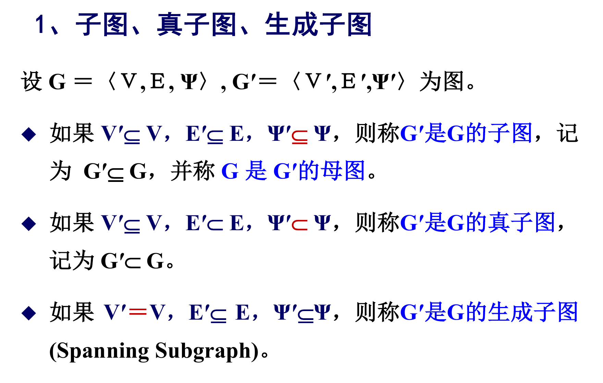
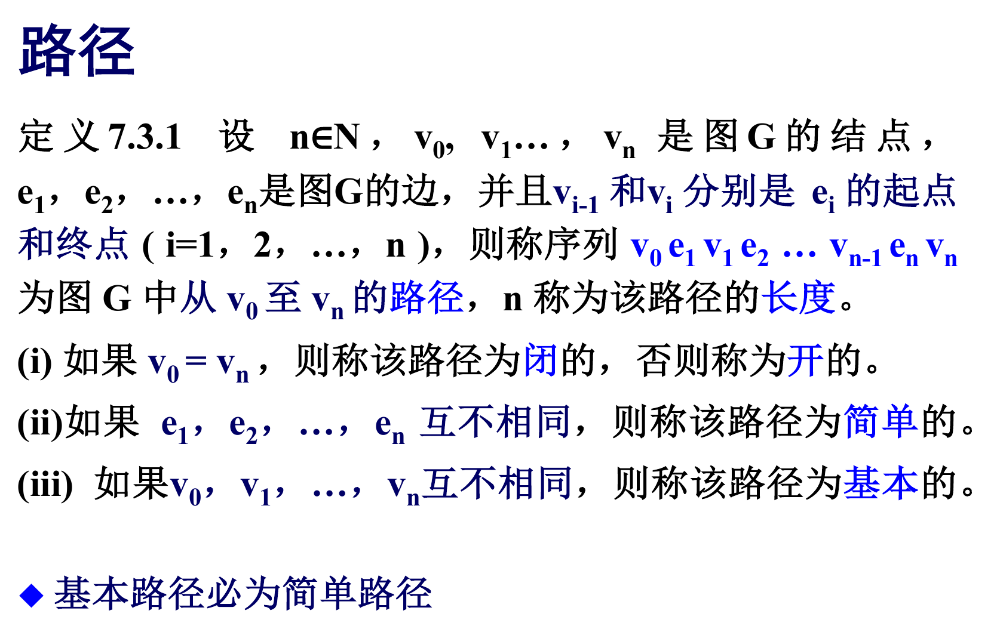
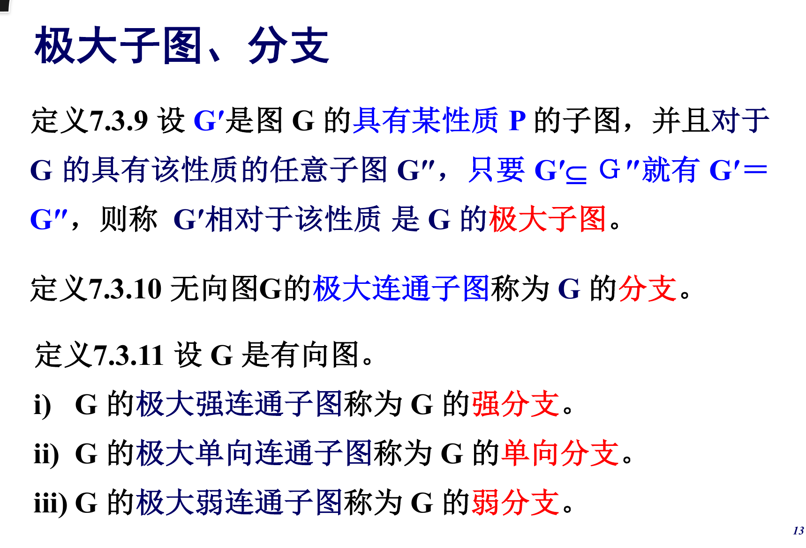
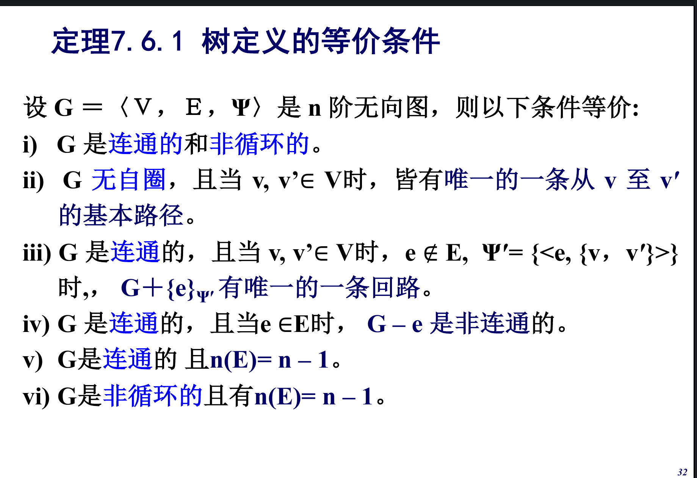

## 面经

### 计算机组成

#### 中断和程序查询的区别？

程序查询方式是CPU不断的对外设的状态的进行查询，直到外设做好准备，从而控制I/O设备与主机交换信息，CPU会一直被外设所阻塞，不能执行其他的任务。

中断方式，只有在IO设备做好准备并向CPU发送中断请求时，CPU才会对中断进行响应，否则CPU会继续执行自己的任务。

#### 哈佛结构、冯诺依曼结构

哈佛结构是一种将程序指令存储和数据存储分开的存储器结构。哈佛结构是一种并行体系结构，它的主要特点是将程序和数据存储在不同的存储空间中，即程序存储器和数据存储器是两个独立的存储器，每个存储器独立编址、独立访问。

哈佛结构与冯·诺依曼结构处理器相比，处理器有两个明显的特点：使用两个独立的存储器模块，分别存储指令和数据，每个存储模块都不允许指令和数据并存；使用独立的两条总线，分别作为CPU与每个存储器之间的专用通信路径，而这两条总线之间毫无关联。

### 操作系统

#### 说出五种进程调度算法，Windows 和 Linux 采用的是哪一种

调度算法：

* 短作业优先
* 先来先服务
* 时间片轮转
* 多级反馈队列
* 高响应比优先

win和linux的调度算法不能指定说是某一种特定的调度算法，在实际的操作系统中调度算法往往需要考虑很多因素，比如进程优先级，响应比，以及进程的本身和重要性，比如linux进程可分为实时进程，普通进程等，操作系统的调度各有特点，win的调度算法拥有CPU亲和性，某些进程只能在某些特定的CPU上运行。

linux的调度算法是将时间片轮转，优先级调度、先进先出调度等多个算法结合在一起的算法。

#### 简要介绍OS实验课做了什么

#### 进程有哪些状态，他们之间如何转换？

创建、就绪态，运行态，阻塞态，终止

#### 进程同步的意义

实现多个进程在执行次序上的协调。

#### Windows / Linux 下进程间通信的手段

低级和高级

低级是PV操作

高级是共享存储，消息传递，管道通信

共享存储，共享访问一个空间。低级的是数据结构的共享，高级的是基于存储区的共享。

**消息传递**

直接通信：发送方将消息发送到接收方，并挂在接收进程的消息缓冲队列中。

间接通信：消息发送到某个中间实体，接收方从中间实体那里获取消息，中间实体一版称为信箱。

#### 银行家算法

银行家算法的实现思想：允许进程动态地申请资源，系统在每次实施资源分配之前，先计算资源分配的安全性，若此次资源分配安全（即资源分配后，系统能按某种顺序来为每个进程分配其所需的资源，直至最大需求，使每个进程都可以顺利地完成），便将资源分配给进程，否则不分配资源，让进程等待。 

#### Cache替换策略

#### 线程和进程的联系与区别，为什么要引入线程

进程是系统分配资源的单位，

线程是CPU调度和分配的单位，基本上不拥有资源，只有必不可少的少量资源，可以与同进程的其他线程共享进程的所有资源。

目的：减少程序再并发执行时所付出的时空开销，提高操作系统的并发性能。

#### 内存泄露

内存泄漏（Memory Leak）是指程序中己动态分配的堆内存由于某种原因程序未释放或无法释放，造成系统内存的浪费，导致程序运行速度减慢甚至系统崩溃等严重后果。

#### 页式存储管理的优劣

优点：不产生外碎片，产生的内碎片的大小会不超过一个页的大小。

缺点：单纯的分页存储管理，程序需要一次性装入内存，在使用请求分页的管理方式下，需要对应的硬件支持，比如中断处理和地址转换功能。

### 编译技术

五个基本逻辑部分：

词法分析-语法分析-语义分析并生成中间代码-代码优化-生成目标程序

其中符号表的管理和错误处理贯穿上面的五个部分

编译文法的类型

0 1 2 3 

#### 用 C 语言时，函数在不同作用域可以定义同名变量，在编译上如何实现

 使用栈式符号表，进入一个函数时，创建符号表，执行结束，符号表便被销毁，从符号表栈中弹出，每次检查当前符号表是否包含此变量，不包含便向外层符号表进行查询。

#### 语法分析的定义和作用

根据语法规则（即语言的文法），分析并识别出各种语法成分，如表达式、各种说明、各种语句、 过程、函数等，并进行语法正确性检查。

#### 指针的编译

#### 寄存器的分配

#### C语言堆和栈内容的区别

堆的内容分配是程序手动分配，并需要程序在是使用后手动释放，但必须及时释放否则会导致内存泄漏。

栈上的内容是在程序运行时自动分配和释放的。

#### 编译执行和解释执行的优劣

编译执行是一次性编译成目标程序，然后机器运行目标程序

解释执行是不直接翻译为机器语言，而是先翻译成中间代码，再由解释器对中间代码进行解释执行。

编译执行执行速度快，因为省略了编译这一步，但灵活性不高，目标程序的运行需要在

解释执行速度慢，灵活性高，可移植性好。

### 计算机网络

#### 子网掩码

一个网络地址是否是当前网络中的地址。

#### 计网的七层、五层模型

七层：物理层、数据链路层、网络层、传输层、会话层、表示层、应用层。

五层：物理层、数据链路层、网络层、传输层、应用层。

#### 浏览器输入域名

解析url，获取一系列的信息，生成HTTP请求消息，通过OS进行发送，但需要告诉OS服务器到ip的映射，DNS服务器（UDP），得到IP地址，然后浏览器委托OS，发送请求，OS建立TCP连接（过程），发送http请求报文，接受http响应报文，浏览器展示内容，根据http协议的版本不同，连接建立和断开的方式也不同，1.0无状态，1.1允许持续连接，提高效率。在网页关闭，TCP断开。

#### TCP拥塞控制

拥塞控制是指避免网络上注入过多的报文，这样可以使网络中的路由器 或链路不致过载。

慢开始，拥塞避免，快重传，快恢复。

####  交换机的工作内容

工作在数据链路层，连接多个以太网物理段，隔离冲突域，对以太网帧进行转发，能够自行学习和维护MAC地址信息。

#### 网关协议，路由协议

OSPF，RIP，BGP

TCP面向连接，UDP面向报文

#### 为什么不能手机号实现IP地址，手机号和IP号有什么本质区别

#### IGP和EGP的区别

IGP：在一个自治系统内部使用的路由选择协

议。

EGP：源主机和目的主机处在不同的自治系统中，而两个不同的自治系统内部使用的协议可能不同，当数据报传输到一个自治系统的边界时，就需要使用一种协议将路由选择信息传递到另一个自治系统中。

#### 路由器和交换机的对比

路由器工作在网络层

交换机工作在数据链路层

### 数据结构

#### 最小生成树

#### 最短路径

#### 稳定排序

假设排序前a[i]=a[j]，且i的位置在前，而j的位置在后，排序后仍然能够保证这样的顺序，那么就成该排序算法是稳定排序算法。

### 离散数学

#### 笛卡尔积

集合A和B的笛卡尔乘积
$$
AXB = \{<x,y> | x \in A \ \& \ y \in B \}
$$

#### 关系

#### 图

#### 关系图

#### 关系矩阵

#### 二元关系

* 自反。（关系图中，以下同此）每一个顶点都有自环，（关系矩阵，以下同）主对角线都为1
* 反自反。每一个顶点都无自环，对角线都为1
* 对称。任意两个不同顶点之间：或者无弧，或者有两条相反的弧。R的关系矩阵是对称矩阵。
* 反对称。任意不同顶点之间最多有一条弧。
* 传递。若顶点x到顶点y有一条路径，则必有从x到y的一条边。

#### 关系运算

逆，交并补

关系的合成

#### 关系的闭包

包含关系R的最小自反（对称、传递）关系。

#### 次序关系

R是**偏序关系**当前仅当R是**自反的**、**反对称**的和**传递**的。

R是**严格偏序关系**（又称拟序关系）当且仅当R是**反自反**的和**传递**，并由此可以推断R是**反对称**的。

#### 覆盖

#### 良序

#### 相容关系

集合A上的关系R是**自反**和**对称**的，则称R为A上的**相容关系**。

此时r(R) = s(R) = R。

#### 等价关系

集合A上的关系R是**自反**、**对称**、**传递**的，则称R是A上的**等价关系**

#### 等价类

#### 集合的划分

#### 商集

### 函数

函数是一种特殊类型的二元关系。

#### 部分函数

#### 单射，满射，双射

#### 可逆

#### 集合的势

两个集合A和B，若存在A到B的双射则称A和B对等，或A和B等势。等势关系本身是等价关系。

**有限集**

任何有限集合都不能与其真子集对等。

### 图

没有自圈和平行边的图称为**简单图**。

无向图节点的度是边的两倍。

度数为奇数的节点称为奇节点

度数为偶数的节点称为偶节点

度数为0的节点称为孤立节点

度数为1的节点称为断点。

节点都是孤立的点的图称为零图。

一阶零图称为平凡图

所有节点的度均为自然数D的无向图称为d度正则图。

如果n阶简单无向图G是n-1度正则图，则称G为完全无向图。

如果每一个结点的出度和入度都是n-1的n阶简单有向图称为完全有向图。

#### 子图、真子图、生成子图

导出子图：从原图中的取出一部分顶点为V，以所有起点和终点都在V中的边为边集合的G的子图称为由V导出的G的子图，记为G[V]

#### 图的运算

图的可运算：

图的三个运算：

* **交**。即以顶点的交和边的交的集合的图，称为交。
* **并**。以顶点的并，边的并为集合的图，称为并。
* **环和**。以顶点的并，边的异或为集合的图，称为环和。

图运算具有唯一性。即图运算的结果具有唯一性。

**补图**：一个n阶无向图G<V，E，*>是n阶完全无向图K的生成子图，则称K-E为G的补图

简单无向图都有补图，一个简单无向图的所有补图都同构

#### 路径

边互不相同称为简单路径。

顶点互不相同称为基本路径。

如果两点之间存在路径，那么一定存在基本路径

#### 可达

在图中存在从v1到v2的路径，则称在图中v1和v2可达。

#### 无向图的连通

无向图中的任意两个结点都互相可达，则称图是连通的，否则是非连通的。

#### 有向图的连通

有向图的基础图，将有向图的有向边转变为无向边得到的无向图称为有向图的**基础图**。

如果有向图中的任意两个结点都相互可达，则称G是强连通。

如果对于有向图的任意两个结点，必有一个结点可达另一个结点则称有向图是单向连通的。

如果G的**基础图**是连通的，则称G是弱连通的。

#### 极大子图

连通无向图恰有一个分支。

非连通无向图的分支多于一个。

有向图的每一个结点和每条边恰处于一个若分支中。

强连通（单向连通，弱连通）的有向图恰有一个强分支（单向分支，弱分支）

非强连通（非单向连通，非弱连通）有向图有一个以上强分支（单向分支，弱分支）

#### 半路径

设G1是有向图G的基础图，则G1中的路径称为G中的半路径。

#### 回路

连通2度正则图称为回路。

基础图是回路的有向图称为半回路。

每一个结点的出度和入度均为1的弱连通有向图称为有向回路。

如果回路（有向回路，半回路）C是图G的子图，则称G有回路（有向回路，半回路）C

没有回路的无向图和没有半回路的有向图称为**非循环图**。

如果一个有向图有子图G，使得对于G的任意结点v都有**v的入度大于0**，则原图**有有向回路**。

如果一个有向图有子图G，使得对于G的任意结点v都有**v的出度大于0**，则原图**有有向回路**。

图G**不是非循环图**当且仅当G有子图G1，使得对于G1的任何结点v都有v的度大于1。

#### 点割集

设无向图G是连通图，若有点集V1是G点集V的真子集，使得

* 图G删除了V1的所有结点后，所得的子图是不连通图

* 而删除了V1的任何真子集，所得到的子图仍是连通图

则称V1是G的一个点割集。

无向图的点连通度（简称连通度）：连通度表示为了产生一个不连通图所需要删除的点的最少数目。

#### 边割集

设无向图G为连通图，若有边集E1是G边集E的真子集使得

* 图G删除了E1的所有边后，所得子图是不连通图
* 而删除了E1的任意真子集后，所得的子图仍是连通图，

则称E1是G的一个边割集。

边连通度：是为了产生一个不连通图所需要删除的边的最少数目。

#### 欧拉路径

图G包含其所有边的简单开路径称为G的欧拉路径

图G中包含其所有边的简单闭路径称为G的欧拉闭路。

#### 欧拉图

每一个结点都是偶结点的无向图称为欧拉图。

每一个结点的出度和入度都相等的有向图称为欧拉有向图。

#### 欧拉定理

G是**连通无向图**，G是欧拉图当且仅当G有欧拉回路。

#### 哈密顿回路

如果回路（有向回路）C是图G的生成子图，则称C为G的哈密顿回路（哈密顿有向回路）

图G中包含它所有结点的基本路径称为G的哈密顿路径。

有哈密顿回路（有向回路）的图称为哈密顿图（哈密顿有向图）

### 树

树的定义

每一个分支都是树的无向图称为森林。

#### 生成树

如果树T是无向图G的生成子图，则称T为G的生成树。

如果森林F是无向图G的生成子图，则称F为G的生成森林。

最小生成树：

prim算法：贪心算法，将结点分为最小生成树中的结点和不在最小生成树中的结点，随后每次从树中的结点的所有边中的最小的边所连接的顶点加到树中结点，直到全部结点都被加入。

优化：由于每次都需要在当前顶点的全部边中查找最短的边，耗费时间，所以采用松弛操作，维护一个数组来记录当前顶点到树中结点的最小值，也即树中全部结点的最小值，每次新加入一个结点就对新加入结点所连接的边进行松弛。

Kruskal：贪心算法，将边按照从小到大排序，按照顺序选边，只要不与当前已选择的边构成循环，就选择，直到选择了所有的边。

优化：由于判断循环需要使用dfs或bfs比较耗时，所以采用并查集的形式进行优化。

设 T 是连通无向图 G 的生成树,称 T 的边为枝,而 G 的不属于 T 的边称为 弦

设 T 是连通无向图 G 的生成树,G 的只包含一条弦的回路称为**基本回路**

#### 有向树

一个结点的入度为 0,其余结点的入度均为 1的弱连通有向图 称为有向树。
